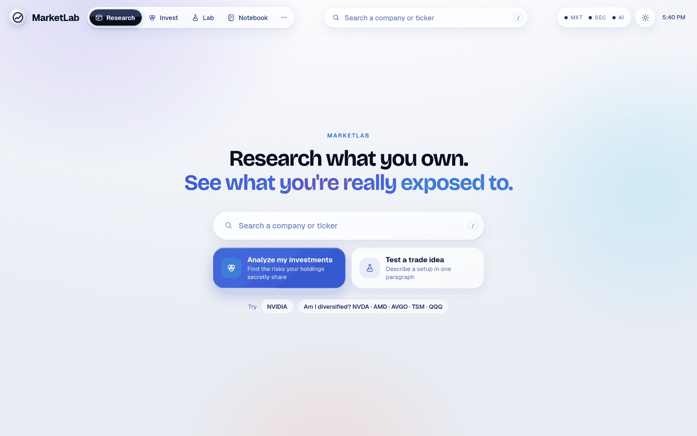
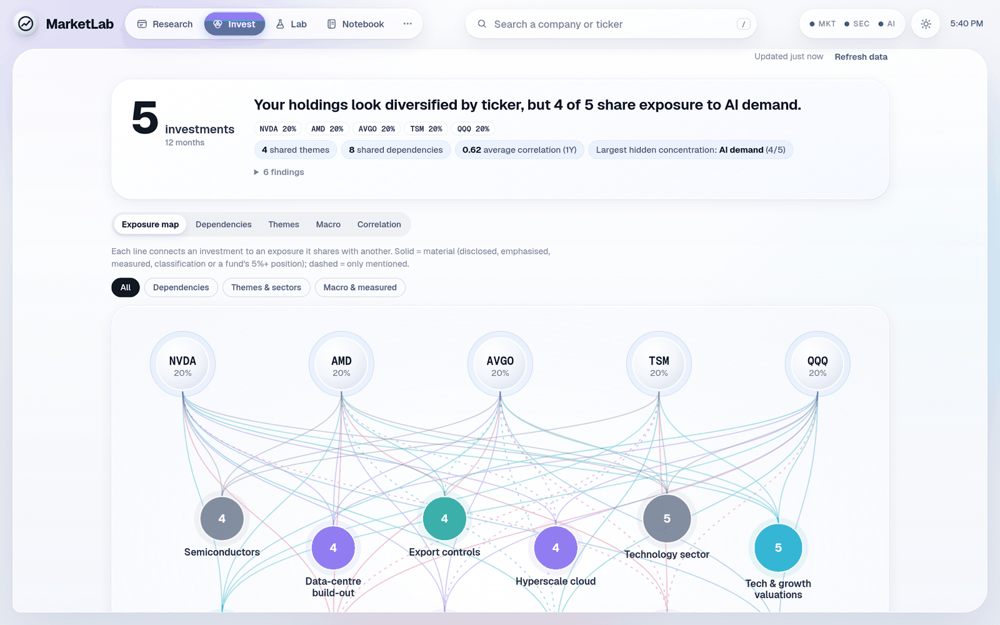
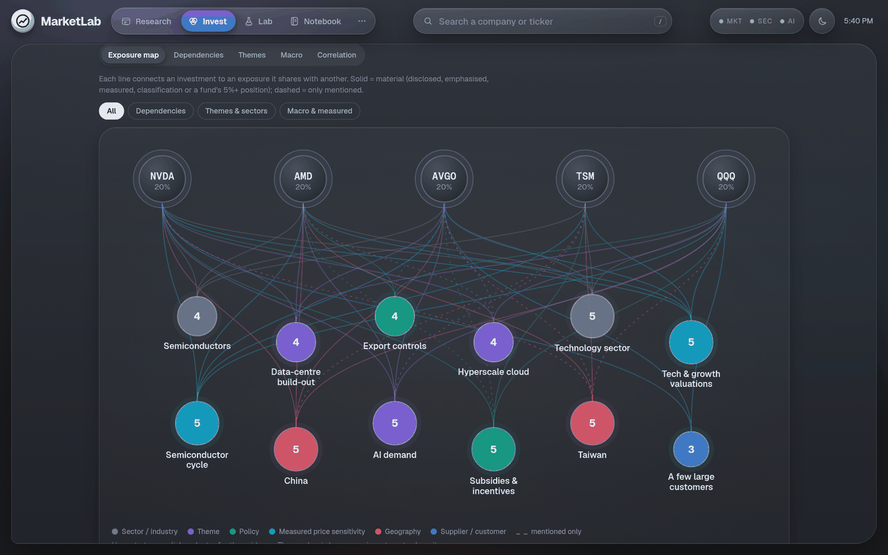
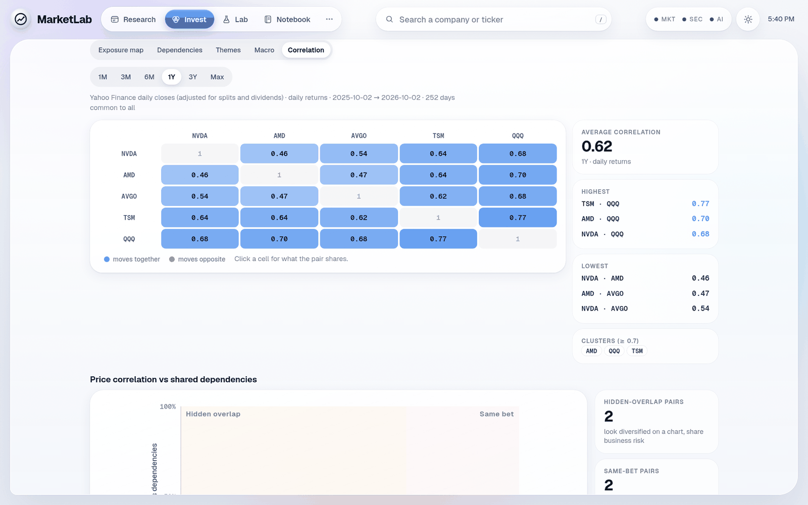
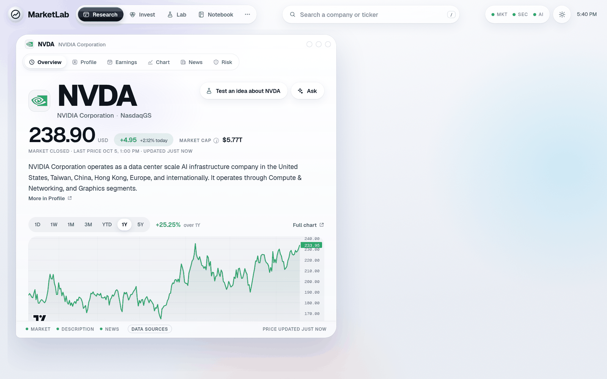

# MarketLab

**A local stock-research workbench that shows what your portfolio is really exposed to — built from SEC filings and market data, with every claim traced back to its source.**



## What it does

Most portfolio tools tell you your sector split. MarketLab asks a harder question: *if five different tickers all depend on the same supplier, the same customers, the same country or the same policy, are you actually diversified?*

Type your holdings, or just describe them in plain English (*"Nvidia, AMD and some QQQ for five years"*). MarketLab reads each company's latest annual report (10-K) from SEC EDGAR, looks through ETFs to their top holdings, measures price correlation over several lookbacks, and shows the risks your holdings share:

> *Your holdings look diversified by ticker, but 4 of 5 share exposure to AI demand.*

It also has a **Research** view for single companies (overview, profile, earnings, chart, news, risk) and a **Lab** where you describe a trade idea in a sentence and it's turned into explicit rules and back-tested on historical data.

### Why I built it

I wanted to understand what I actually owned, not just what the tickers were called. Every tool I tried either hid its reasoning or invented relationships. So MarketLab has one rule: **it never makes up a dependency.** Each one comes from a quoted passage in a filing, a reported number or a classification, and the app shows you which. It describes exposure. It doesn't tell you what to buy.

## Screenshots

| Portfolio summary | Hidden exposure map (dark mode) |
|---|---|
|  |  |

| Correlation across lookbacks | Company research |
|---|---|
|  |  |

## Key features

- **Hidden-exposure analysis.** Shared suppliers, customers, geographies, policies and themes across a portfolio, drawn as an interactive graph, with every edge backed by a quote from the filing.
- **Four separate lenses**, kept apart on purpose: *Dependencies* (from filings), *Themes*, *Macro* (fundamental vs. statistically measured) and *Correlation* (1M–Max, with clusters). Correlation is not the same thing as dependency, and the app says so.
- **Plain-English input that doesn't guess.** "Nvidia" becomes NVDA, but the words "AI", "IT", "ON" and "ALL" are never treated as tickers, even though they are real ones. When something is ambiguous it asks: *"Did you mean Ford (F)?"*
- **Scenarios.** "What if AI capex slows?" traces which holdings the event reaches and through which exposure. It doesn't forecast returns.
- **Multiple saved analyses** with tags, notes, duplicate, compare and autosave. Only your inputs are stored; results are recomputed.
- **Lab:** a trade idea written as a sentence is turned into explicit conditions and tested on historical bars, with no look-ahead, robust statistics (bootstrap CIs, trimmed and winsorized means) and a "challenge" pass that looks for outliers, regime dependence and fragile parameters.
- **Ask MarketLab searches the web for current events.** "Why is this stock down today?" uses MarketLab's own price, peer, news and filing data first, then several official web searches. Answers separate today / this week / older, cite every current claim with a link, and say "no clear catalyst found" instead of inventing one.
- **Light and dark themes**, keyboard navigation, and it works at phone width.

## Tech stack

| Layer | Choice |
|---|---|
| Backend | Python 3, Flask (JSON API) |
| Data | SEC EDGAR (filings, XBRL financials), Yahoo Finance via `yfinance`, several free news sources |
| Analysis | Pure Python + pandas: correlation, sensitivities, robust statistics, text extraction from 10-Ks |
| Frontend | Vanilla JavaScript, HTML, CSS (no framework), SVG graphs, TradingView Lightweight Charts |
| AI (optional) | Anthropic Claude for company-summary clean-up and a sourced Q&A assistant |
| Tests | `unittest` (~180 tests, offline with stubbed data), Playwright browser regression test |

Roughly 19k lines of Python (including tests) and 9k lines of JavaScript.

## Run it locally

You need **Python 3.10+**. On macOS or Linux:

```bash
git clone https://github.com/jtouevsky/marketlab.git
cd marketlab
python3 -m venv .venv
source .venv/bin/activate          # Windows: .venv\Scripts\activate
pip install -r requirements.txt
cp .env.example .env               # then edit .env (see below)
python3 marketlab.py
```

Your browser opens at **http://127.0.0.1:8050**.

**Settings (`.env`):** everything is optional, and features switch themselves off without their key.

- `SEC_USER_AGENT="Your Name you@example.com"` turns on SEC filings, which the Invest analysis needs. It's free; the SEC just asks every program to identify itself.
- `ANTHROPIC_API_KEY` turns on AI summaries and the assistant.

**Run the tests:**

```bash
python3 -m unittest discover -s tests
```

## Interesting technical problems

**1. Never inventing a relationship.** Large language models will happily tell you that two companies share a supplier. MarketLab doesn't use model knowledge for dependencies at all. `app/risk_intel.py` extracts exposures from the text of each 10-K, and every exposure carries a *strength*:

- `disclosed`: a named customer above 10% of revenue
- `emphasized`: discussed repeatedly
- `classification`
- `measured`: a statistical price sensitivity
- `look-through`: via an ETF's holdings
- `mentioned`: merely mentioned

Only the material strengths count toward "shared exposure", and the UI shows the quote, filing and date behind each one.

**2. Telling tickers from English.** Many ordinary words are listed tickers, including A, IT, ON, ALL, NOW, CAN and F. `app/resolver.py` resolves prose in stages:

1. Company names and aliases resolve with high confidence.
2. `$TICK` is treated as explicit.
3. An ALL-CAPS token becomes a holding only if it's listed (checked against the SEC's ticker list) *and* not word-like.
4. A word-like ticker only becomes a *question*, and only with context such as "(F)", "ticker F" or the company name nearby.

Nothing uncertain triggers the heavy analysis.

**3. A fast UI without a framework.** An early version re-rendered the whole page as you typed, which lost keystrokes and moved input fields out from under the cursor. The fix was architectural, not cosmetic:

- The page is three independent regions, and typing never re-renders anything.
- Every editable field keeps a local draft, and analysis runs only on an explicit action.
- Each result tab keeps its own DOM pane, so going back to a tab just un-hides it (about 0.2 ms) instead of rebuilding a 160-node SVG graph.
- Profiling (Event Timing API, Chrome DevTools Protocol metrics) showed the slowest interaction was map hover, caused by SVG `drop-shadow` filters plus opacity transitions on about 100 graph edges. Removing those cut it from 56–120 ms to 24–32 ms.

**4. Progressive, cancellable analysis.** Reading filings for five companies takes several seconds the first time. The backend splits the work into two stages:

- A *quick* stage returns names, sectors and price correlation in about 2–3 seconds.
- A *full* stage adds the filings analysis.

Concurrent requests for the same ticker share one fetch through a small single-flight helper (`_single_flight` in `app/invest.py`). On the client, every run carries a run ID and an `AbortController`, so a slow response from an older analysis can never overwrite a newer one, even if you switched to a different saved analysis meanwhile.

**5. Correlation with unequal histories.** If one holding IPO'd last year, a common date range across *all* holdings would shrink every pair to that one year. MarketLab computes each pair on the days *that pair* shares, with a minimum number of observations that scales with the lookback. It reports the range used and flags short-history holdings instead of silently truncating everything.

**6. Back-tests that don't cheat.** In the Lab, conditions are evaluated bar by bar using only data available at that bar; dedicated tests check for look-ahead. Results come with bootstrap confidence intervals and a "challenge" step (time split, recency, parameter neighbours, outlier dependence), so a lucky pattern is easy to spot.

More detail is in [`docs/ARCHITECTURE.md`](docs/ARCHITECTURE.md).

## Project structure

```
marketlab.py         launcher: python3 marketlab.py
app/
  server.py          Flask routes (JSON API)
  invest.py          portfolio exposure analysis, scenarios, correlation
  resolver.py        prose → tickers (with ambiguity questions)
  risk_intel.py      exposure extraction from 10-K filings
  experiments.py …   Lab engine: conditions, experiments, robust statistics
  intraday/          intraday data, detectors, auto-test ladder
  sources/           SEC EDGAR, Yahoo Finance, news, search, AI providers
  static/            JavaScript + CSS (no build step)
  templates/         the single HTML page
tests/               unittest suite + browser regression test
scripts/             data-source diagnostics
tools/               dev helpers (dark-theme CSS generator)
docs/                architecture notes, screenshots
legacy/              the original v0.1 terminal version
```

## Possible future improvements

- **Portfolio import** from a brokerage CSV, with position sizes taken from real holdings.
- **Filing diffs:** what changed in a company's risk factors since last year.
- **Faster cold start:** persist the parsed 10-K exposures to disk and precompute them for common tickers.
- **Smarter text extraction:** use embeddings to catch dependencies phrased in unusual ways, still requiring a quote before anything is shown.
- **A plug-in API for data sources**, so non-US filings (e.g. SEDAR, Companies House) can be added.
- **CI:** run the test suite on GitHub Actions for every push.

## Disclaimer

MarketLab is a research tool, not financial advice. It describes exposures and historical behaviour. It does not recommend trades or forecast returns.

## License

[MIT](LICENSE)
